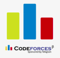

# coding
This is a github repository that stores all my competitive programming codes.

List of directories

* Algorithm
* June 2020
* May 2020
* unorganized
* read-only.cpp
* changeable-template.cpp

```C++
    #include<bits/stdc++.h>

    using namespace std;

    int main(){
        cout << "Hello world" << endl;
        return 0;
    }
```


Follow me on LinkedIn: [Monzur Rahman](https://www.linkedin.com/in/monzur-rahman-baba02190/)

Codeforces handle: [Kari_Kari](https://codeforces.com/profile/Kari_Kari)

 


